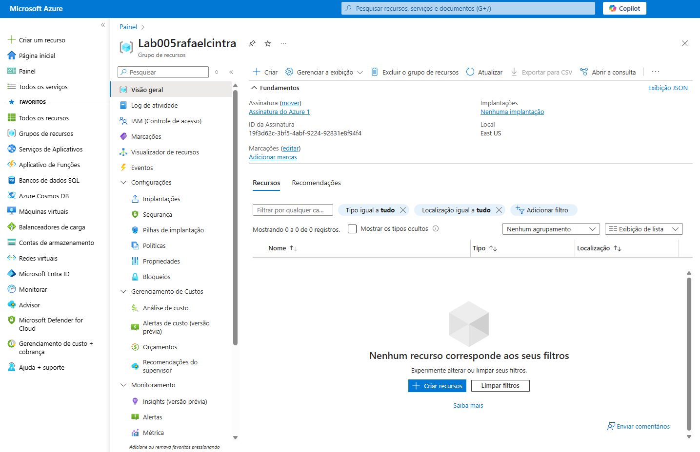
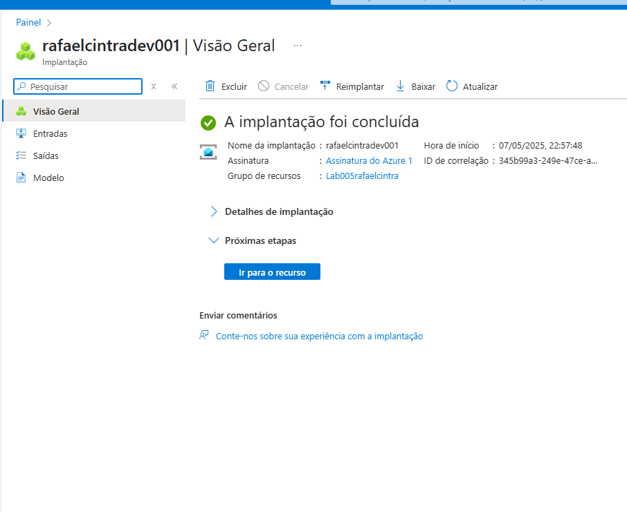
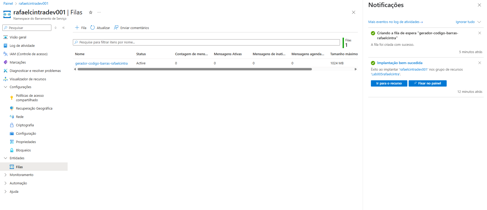

# 💳 Autenticador de Boletos - DIO Lab05

Este projeto é um **Autenticador de Boletos** desenvolvido como parte do **Lab05 da DIO**. O objetivo é ler, validar e formatar códigos de barras e linhas digitáveis de boletos bancários brasileiros, garantindo que estejam corretos e prontos para pagamento.

## 🚀 Funcionalidades

✅ Leitura da **linha digitável** e/ou **código de barras**  
✅ Validação de boletos bancários e de concessionárias  
✅ Cálculo automático de dígitos verificadores (mod 10 e mod 11)  
✅ Formatação para exibição em padrão de pagamento  
✅ Identificação do tipo do boleto (bancário ou arrecadação)

---

## 🛠️ Tecnologias utilizadas

- **Java**
- **Spring Boot**
- **JUnit** (para testes)
- **Maven**
- **Postman** (para testes de API)

---

## 📸 Comprovantes de funcionamento

| Leitura do Boleto |
|:-----------------:|
|  |
| Validação         |
|:-----------------:|
|  |
| Resposta da API |
|:-----------------:|
|  |

## 🧪 Como testar localmente

1️⃣ Clone o repositório:

```bash
git clone https://github.com/rcintra61/autenticador-de-boletos-dio-lab05.git
cd autenticador-de-boletos-dio-lab05
